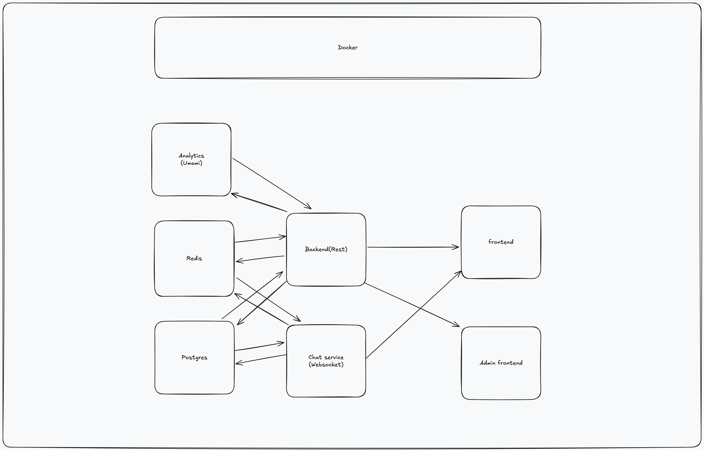

# Real Estate Web App
A modern and user-friendly real estate web application that allows users to view, search, and filter property listings, as well as upload and manage their own listings. Built with cutting-edge web technologies for a smooth and seamless experience.

**Live Site**: 🌐 [https://daningatlan.duckdns.org](https://daningatlan.duckdns.org)


**Build status** [](https://github.com/danielkoh99/real-estate/actions/workflows/docker-publish.yml)


## System architecture



## Features

- **Browse Listings**: View available properties with detailed information, including price, location, and size.
- **Search & Filter**: Easily search for properties by location, price range, and more.
- **Upload Listings**: Users can upload and manage their own property listings.
- **Responsive Design**: Optimized for both desktop and mobile devices for a consistent user experience.
- **Map View**: Integrated map view to visualize property locations geographically.

## Technologies Used

- **Frontend**: React.js, Next.js, Typescript, Tailwind CSS, Tanstack Query
- **Backend**: Node.js, Express.js, Typescript
- **Database**: SQLite with Sequelize
- **Authentication**: JWT (JSON Web Token)
- **Other**: Axios for API requests, HeroUI for component library

## Installation

Clone the repository and install the dependencies:

```bash
git clone https://github.com/danielkoh99/real-estate.git
cd real-estate
npm install
```

Run the app locally:

```bash
npm run dev
```

Visit `http://localhost:3000` in your browser to see the application.

## Usage

- Users can browse available listings, use the search and filter options to find their ideal property, and view the details of each listing.
- To upload a listing, sign up or log in, then navigate to the "Upload Listing" section to add a new property.

## TODO

- [ ] Redis cache
- [ ] Advanced filtering
- [ ] Chat
- [ ] Edit/delete property
- [ ] Analytics [https://umami.is/docs](https://umami.is/docs)
- [ ] Post property at certain time
- [ ] Admin dashboard
- [ ] External API
- [ ] Payment integration
- [ ] GraphQL endpoint
- [ ] Upload person profile image
